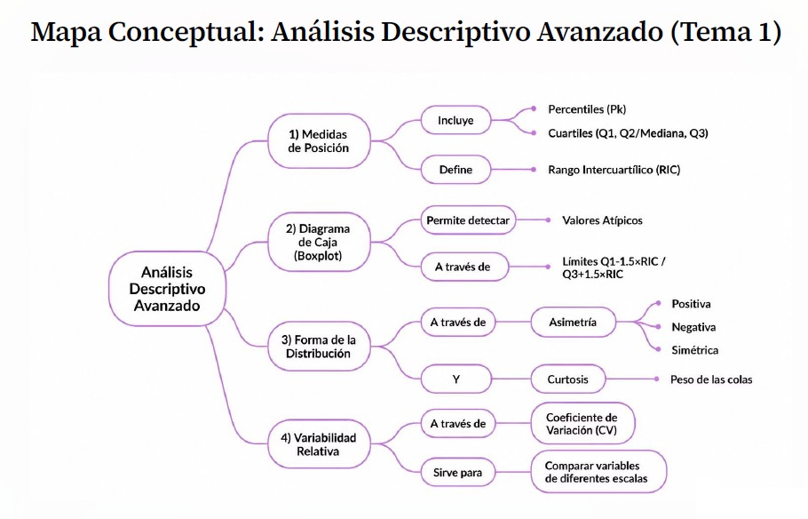
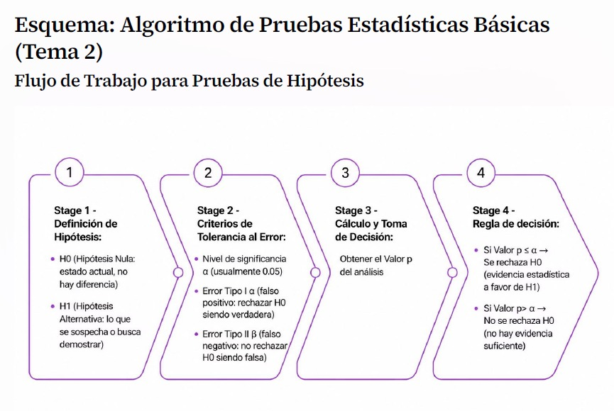
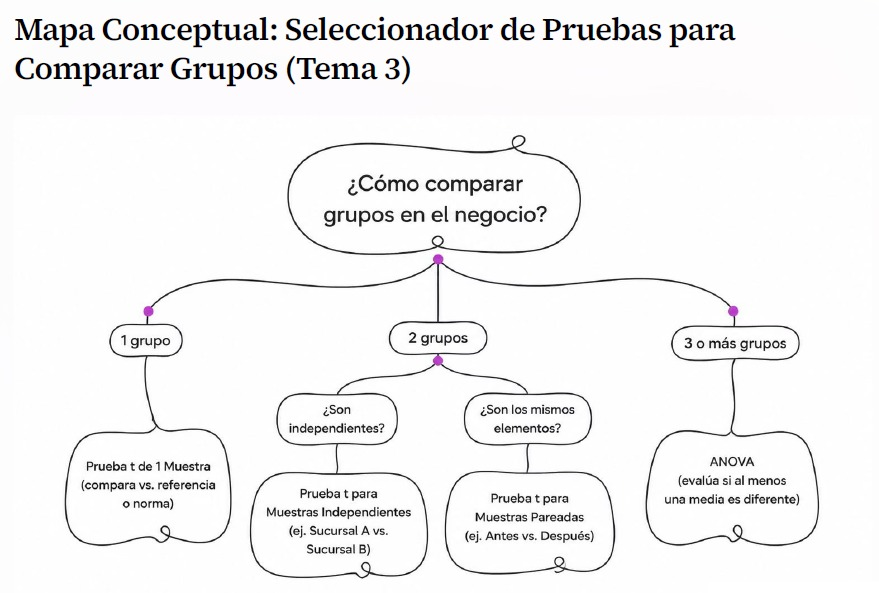
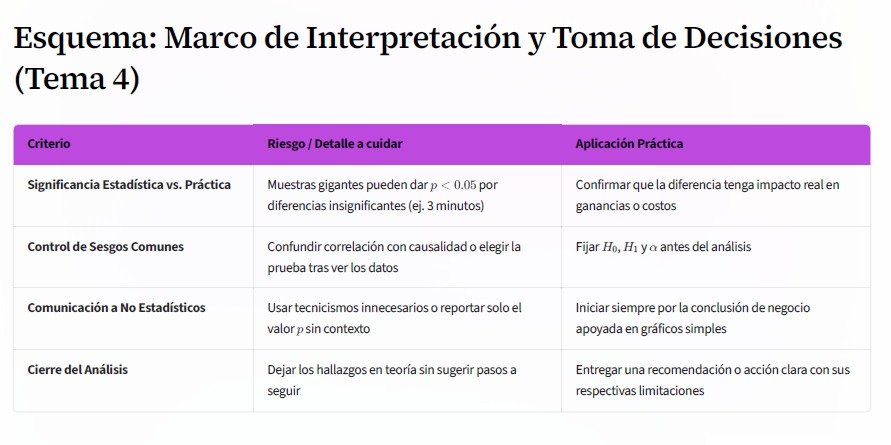

# Programa de Ciencia de Datos  
**Estudiante:** Frenny Montezuma Castillo 
**Fecha:** 2026

---

##  Descripción del Proyecto
Este repositorio contiene las asignaciones, mapas conceptuales y materiales desarrollados durante los módulos del curso de Fundamentos de Ciencias de Datos. El objetivo principal es estructurar y visualizar los conceptos clave del manejo, análisis de datos, roles profesionales y sus bases matemáticas.

---

##  Contenido del Repositorio por Módulos

### 📚 MÓDULO 01: Fundamentos de ciencia de Datos

A continuación se desglosan los entregables incluidos en el primer módulo junto con sus respectivas ayudas visuales:

#### 1. Modelado y Análisis de Datos
Estructura y desglose de los flujos de información desde la captura de datos brutos hasta la toma de decisiones estratégicas.

*   **`Analis_De_Datos.jpeg`**
    

*   **`MAPA CONCEPTUAL DE DATOS A DECISIONES.jpeg`**
    

#### 2. Roles, Matemáticas y Fundamentos Estadísticos
Exploración de los perfiles profesionales dentro del ecosistema de datos junto con los pilares matemáticos indispensables para el análisis de la información.

*   **`Mapas_DeRoles_Analistas_De_Datos.jpeg`**
    

*   **`Fundamentos Matemáticos y Estadísticos.jpeg`**
    

#### 3. Planificación Estratégica (Caso de Estudio)
*   **`Plan_Nutricional_IA.docx`**: Documento formal que detalla la propuesta aplicada empleando Inteligencia Artificial orientada al entorno nutricional. Puedes encontrarlo en la carpeta de la entrega.

---

### 📚 MÓDULO 02: Manejo y Preparación de Datos

Contenido y asignaciones correspondientes al segundo bloque del curso:

*   📄 **[Materia _ Semana 01.pdf](Módulo_02/Materia%20_%20Semana%2001.pdf)**)*

---
## 📌 Módulo 3: Estadística Aplicada al Negocio — Análisis Descriptivo e Inferencial

En este repositorio se recopilan los mapas conceptuales, esquemas visuales y scripts en Python desarrollados durante el Módulo 3.

---

## 🗺️ Mapas Conceptuales y Esquemas Visuales

### 📊 Tema 1: Análisis Descriptivo Avanzado
*Medidas de posición (cuartiles, percentiles), diagrama de caja (boxplot), detección de valores atípicos mediante el RIC, forma de la distribución y coeficiente de variación.*



---

### ⚙️ Tema 2: Pruebas Estadísticas Básicas
*Estructura de las pruebas de hipótesis ($H_0$ vs. $H_1$), nivel de significancia ($\alpha$), valor $p$, errores Tipo I / II y prueba t de una muestra.*



---

### 🔀 Tema 3: Comparación de Grupos
*Criterios para seleccionar pruebas de comparación: prueba t para muestras independientes, prueba t para muestras pareadas y ANOVA.*



---

### 📈 Tema 4: Interpretación de Resultados
*Significancia estadística vs. significancia práctica, control de errores comunes y marco para comunicar conclusiones a la toma de decisiones.*



---

## 🐍 Caso Práctico en Python: Detección de Atípicos con RIC

A continuación se presenta un script que calcula los límites del **Rango Intercuartílico (RIC)** para identificar clientes con montos de compra inusuales y destacarlos visualmente en un gráfico de barras:

```python
import matplotlib.pyplot as plt
import numpy as np
import pandas as pd

# 1. Datos y cálculo de límites
lista_clientes = [f"C{i}" for i in range(1, 16)]
monto_compras = [45, 52, 38, 60, 48, 55, 42, 50, 58, 47, 5, 53, 310, 44, 49]
datos = pd.DataFrame({"Cliente": lista_clientes, "Monto": monto_compras})

q1_val = np.quantile(datos["Monto"], 0.25, method="linear")
q3_val = np.quantile(datos["Monto"], 0.75, method="linear")
iqr_val = q3_val - q1_val

lim_inf = q1_val - 1.5 * iqr_val
lim_sup = q3_val + 1.5 * iqr_val

# 2. Asignar color rojo a las barras que superan o bajan del límite
colores = [
    "#C0392B" if (m < lim_inf or m > lim_sup) else "#2980B9"
    for m in datos["Monto"]
]

# 3. Crear gráfico de barras
plt.figure(figsize=(9, 5))
plt.bar(
    datos["Cliente"],
    datos["Monto"],
    color=colores,
    edgecolor="black",
    alpha=0.85,
)

# Líneas límite
plt.axhline(
    lim_sup, color="red", linestyle="--", label=f"Lím. Superior ({lim_sup})"
)
plt.axhline(
    lim_inf, color="red", linestyle="--", label=f"Lím. Inferior ({lim_inf})"
)

plt.title("Monto de Compras por Cliente", fontsize=12, fontweight="bold")
plt.xlabel("Cliente")
plt.ylabel("Monto ($)")
plt.legend()
plt.tight_layout()
plt.show()
